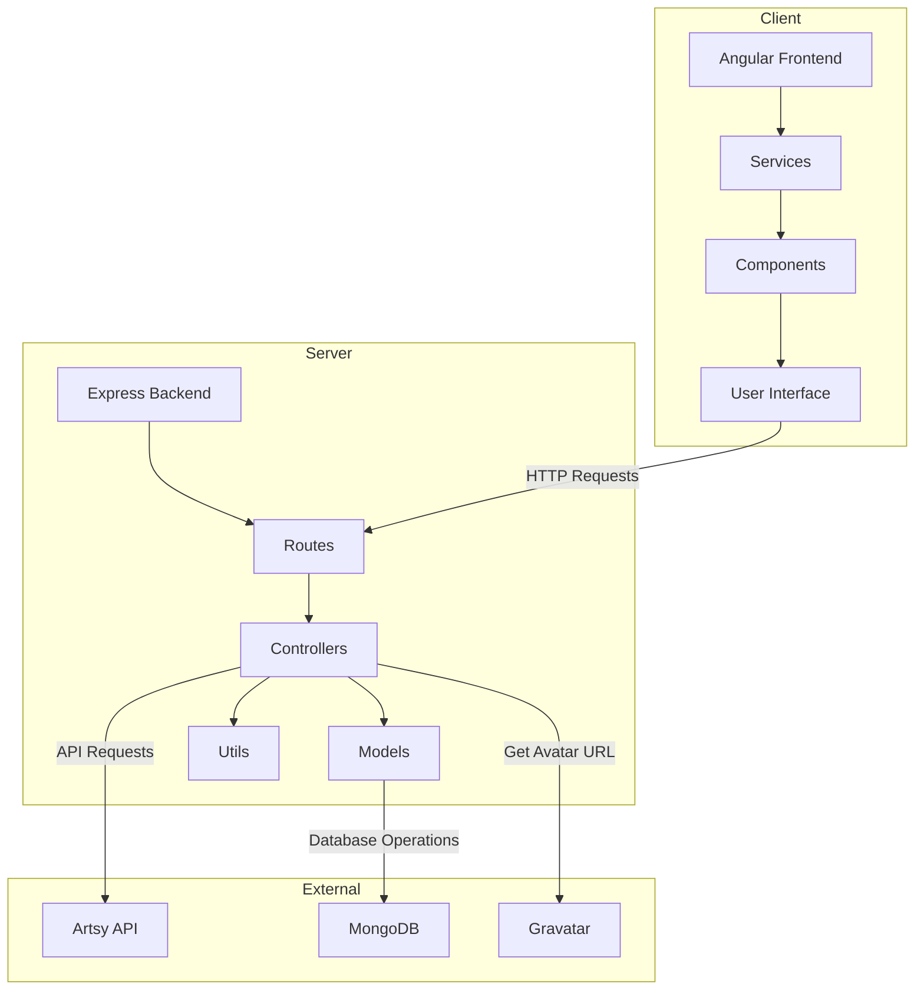

# Artsy Portal

A responsive web application for searching and exploring artists, built with Angular, TypeScript, Node.js, and the Artsy API.

This portal can be reached on: https://csci571-hw5-nrocikay.wl.r.appspot.com/

Details about the front end can be found in this [repo](https://github.com/Omiikay/Artsy-Frontend).

## Project Overview

This Artsy Portal allows users to search for artists using the Artsy API. Users can view artist details, artworks, and artwork categories. Authenticated users can save artists to favorites and view similar artists.

## Features

- **Artist Search**: Search for artists by name
- **Artist Details**: View artist information including name, nationality, birth/death years, and biography
- **Artworks Gallery**: View artworks by the selected artist
- **Categories**: Explore categories of each artwork
- **User Authentication**: Register, login, logout, and delete account
- **Favorites**: Add/remove artists to/from favorites (for authenticated users)
- **Similar Artists**: View artists similar to the selected artist (for authenticated users)
- **Responsive Design**: Optimized for desktop and mobile viewing
- **Notifications**: Display notifications for user actions

## Technologies Used

### Frontend
- Angular
- TypeScript
- Bootstrap 5
- RxJS
- HTML5/SCSS

### Backend
- Node.js
- Express
- MongoDB
- JWT Authentication
- Bcrypt for password hashing

### External APIs
- Artsy API
- Gravatar API

## Architecture Diagram



## Project Structure

```
backend/
│
├── controllers/
│   ├── artsyController.js             # Artsy API controller
│   ├── authController.js              # Authentication controller
│   └── favoriteController.js          # Favorites controller
│
├── middleware/
│   ├── auth.js                        # Authentication middleware
│
├── models/
│   ├── User.js                        # User model
│   └── Favorite.js                    # Favorite model
│
├── routes/
│   ├── artsy.js                   # Artsy API routes
│   ├── auth.js                    # Authentication routes
│   └── favorites.js               # Favorites routes
│
├── utils/
│   ├── artsy.js                       # Artsy API utilities
│   └── gravatarUrl.js                 # Gravatar URL generator
│
├── .env                               # Environment variables
├── package.json                       # NPM package configuration
│   ├── server.js                          # Server entry point
│   └── app.yaml                           # Google Cloud deployment config
│
└── public/                                # The front-end build output
```


## Installation and Setup

### Prerequisites
- Node.js (v14+)
- npm or yarn
- MongoDB Account
- Artsy API Credentials

### Backend Setup
1. Navigate to the backend directory:
   ```
   cd backend
   ```

2. Install dependencies:
   ```
   npm install
   ```

3. Create a `.env` file with the following variables:
   ```
   PORT=8080
   NODE_ENV=development
   MONGODB_URI=your_mongodb_connection_string
   JWT_SECRET=your_jwt_secret
   CLIENT_URL=http://localhost:4200
   ARTSY_CLIENT_ID=your_artsy_client_id
   ARTSY_CLIENT_SECRET=your_artsy_client_secret
   ARTSY_API_BASE=https://api.artsy.net/api
   ARTSY_WEB_URL=https://www.artsy.net
   ```

4. Start the backend server:
   ```
   npm start
   ```

## Deployment

### Google Cloud Platform (GCP) Deployment

1. Set up a Google Cloud account and create a new project
2. Enable the App Engine API
3. Install the Google Cloud SDK
4. Configure the backend's `app.yaml` file
5. Deploy the backend using:
   ```
   gcloud app deploy
   ```

## API Endpoints

### Artsy Endpoints
- `GET /api/artsy/search?q={query}` - Search for artists
- `GET /api/artsy/artists/{id}` - Get artist details
- `GET /api/artsy/artists/{id}/similar` - Get similar artists (authenticated)
- `GET /api/artsy/artists/{id}/artworks` - Get artist's artworks
- `GET /api/artsy/artworks/{id}/categories` - Get artwork categories

### Authentication Endpoints
- `POST /api/auth/register` - Register a new user
- `POST /api/auth/login` - Login user
- `GET /api/auth/me` - Get current user (authenticated)
- `POST /api/auth/logout` - Logout user (authenticated)
- `DELETE /api/auth/delete` - Delete user account (authenticated)

### Favorites Endpoints
- `GET /api/favorites` - Get user's favorites (authenticated)
- `POST /api/favorites` - Add artist to favorites (authenticated)
- `DELETE /api/favorites/{artistId}` - Remove artist from favorites (authenticated)
- `GET /api/favorites/check/{artistId}` - Check if artist is in favorites (authenticated)
